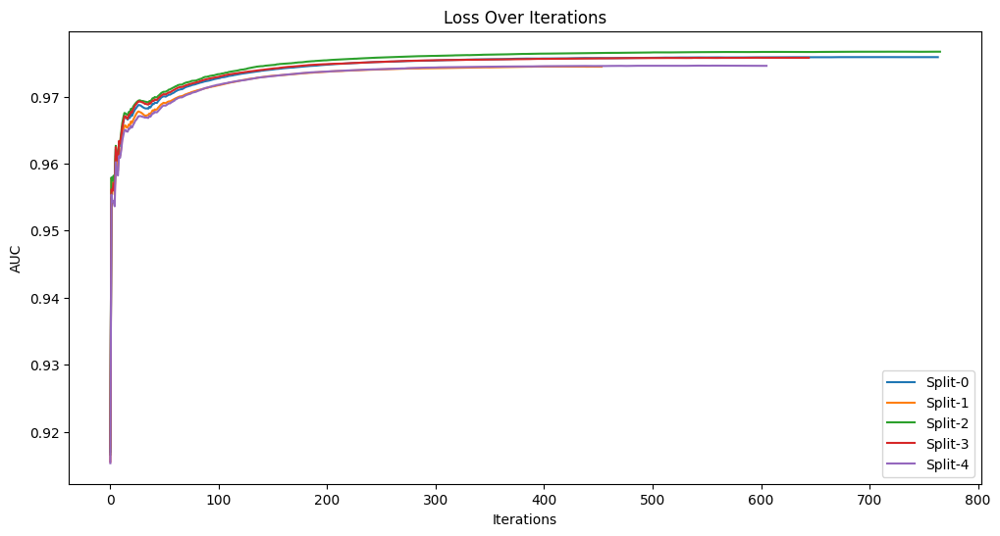
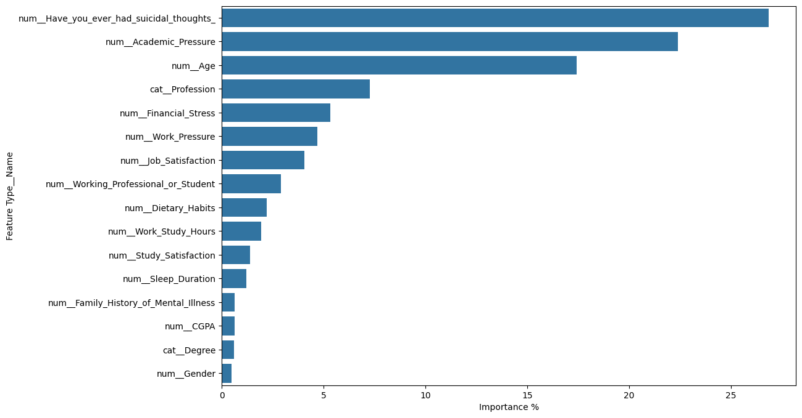

<div align="center">
  <div>
    
  </div>
    <h1>Mental Health Prediction</h1>
</div>

Mental health is a critical aspect of overall well-being, yet it is often overlooked or stigmatized. In today's fast-paced and stress-filled world, understanding and addressing mental health issues has become more important than ever.<br>
By promoting a data-driven understanding of mental health, we can help reduce the stigma associated with mental health issues. Recognizing that factors like job satisfaction, work hours, and financial stress can impact mental health can foster a more supportive and empathetic environment.

## 🎯 **Problem Statement**
The objective is to develop a predictive model that can accurately identify individuals at risk of depression based on their responses to lifestyle and demographic factors.

- **Identify Key Contributors**: Determine which factors are most significantly associated with depression risk.

- **Predict Depression Risk**: Build a model that can predict whether an individual is at risk of depression, helping in early identification and intervention strategies.

- **Provide Actionable Insights**: Offer insights that could inform public health policies and individual lifestyle changes to mitigate the risk of depression.

By achieving these objectives, the project aims to contribute to the field of mental health research, providing a non-clinical, data-driven approach to understanding and predicting depression risks.

## 📊 **Dataset Description**
This dataset was collected through an anonymous survey conducted between January and June 2023, 
focusing on understanding depression risk factors among adults. The survey targeted both working professionals and students, 
collecting comprehensive information about their demographic details, academic/work life, lifestyle factors, mental health history, 
and current mental well-being status.

The original dataset is available [here](https://www.kaggle.com/datasets/sumansharmadataworld/depression-surveydataset-for-analysis/data).

### 📜 **Dataset Columns**
Here's a breakdown of the columns in the dataset:
- `Name`: Identifier for participants (anonymized)
- `Gender`: Participant's gender identity
- `Age`: Participant's age
- `City`: Location of residence
- `Working Professional or Student`: Current occupation category
- `Profession`: Specific profession/field of work
- `Degree`: Educational qualification
- `CGPA`: Academic performance measure
- `Academic Pressure`: Level of pressure from academic responsibilities
- `Work Pressure`: Level of pressure from work responsibilities
- `Study Satisfaction`: Level of satisfaction with studies
- `Job Satisfaction`: Level of satisfaction with current job
- `Work/Study Hours`: Daily hours spent on work/study
- `Sleep Duration`: Average daily sleep hours
- `Dietary Habits`: Eating patterns and food preferences
- `Have you ever had suicidal thoughts?`: History of suicidal ideation (Yes/No)
- `Financial Stress`: Level of stress related to financial situation
- `Family History of Mental Illness`: Presence of mental illness in family (Yes/No)

## 📝 **Results**
Training the predictive model provided significant insights to better understand the factors influencing depression risk.

### 🏆 **Competition Result**
The model was tested against an unseen set of data and scored AUC 0.94003 on [this](https://www.kaggle.com/competitions/playground-series-s4e11/overview) competition.<br> 
This performance is just 0.00181 away from the top solution in terms of accuracy.

### 📉 **Cross validation Loss Graph**
Cross validation AUC loss shows homogeneous accuracy of ~0.97547 over all 5 folds.


### 🌟 **Feature Importance**
The feature importance graph highlights the most influential factors in predicting depression risk. This allows us to identify key contributors and understand which variables have the most significant impact on our model's predictions.


### 📈 **Key Findings**
1. **History of Suicidal Thoughts**: The most significant factor affecting depression risk, indicating the critical need for addressing this in mental health interventions.
2. **Academic Pressure**: A major contributor, highlighting the impact of academic stress on mental health.
3. **Age**: An important predictor, with certain age groups being more vulnerable to depression.
4. **Profession**: The type of profession plays a notable role in depression risk, suggesting that some fields may be more stressful than others.
5. **Financial Stress**: A strong correlation with increased depression risk, emphasizing the importance of financial stability.
6. **Work Pressure**: High levels of work pressure significantly contribute to depression risk.
7. **Job Satisfaction**: Low job satisfaction is a key predictor of depression.
8. **Occupation Category**: Being a working professional or a student also influences depression risk.
9. **Dietary Habits**: Eating patterns and food preferences are associated with mental health.
10. **Work/Study Hours**: Extensive work or study hours are linked to higher depression risk.


#### 📚 **Class 12 and Depression Risk**

Further data analysis reveals that Class 12 students have a disproportionately high chance of being depressed compared to other degrees.

Class 12 in India (where data was collected) corresponds to the final year of secondary high school, typically involving students aged 17-18. This period is marked by significant academic pressure as students prepare for critical examinations that impact their future educational and career opportunities.

##### 💡 **Hypothesis: Academic Pressure**
The high depression rates among Class 12 students appear to be linked to the extreme pressure to perform academically. Sources indicate that this pressure peaks during the final year of school.

##### 🔬 **Supporting Evidence**
- **Research from the NIH**: A study in Karnataka, India, found that 28% of Grade 11 and 26% of Grade 12 students experience high or extreme stress.
- **Sources of Stress**: Major stressors include:
  - Lack of time for revision (38.7%)
  - Academic queries from neighbors or relatives (34.4%)
  - Parents' expectations about academic performance (33.4%)

These findings underscore the need to address the academic and societal pressures faced by adolescents in their final year of secondary education to improve their mental health outcomes.

## 🚀 Getting Started

### 🌐 Live Preview

Check out the live preview on [Render](https://mental-health-pk3l.onrender.com/docs) and try out inference.\
Note: The live preview will cold-start as you enter the link, it could take up to 1min to fully load.

### 🐳 Docker prebuilt

1. **Pull the Docker Image**:
   ```sh
   docker pull ghcr.io/manuel-materazzo/mental-health:latest
    ```
2. **Run the Container**:
   ```sh
   docker run -d -p 8080:80 manuel-materazzo/mental-health
    ```
3. **Access the API**: Navigate to `http://localhost:8080/docs` or `http://localhost:8080/redoc` to explore the
   interactive API documentation and start making predictions!

### 🐳🔧 Docker compose self-build

1. **Run docker compose**:
   ```sh
   docker-compose up
   ```

### 📦 Manual installation

1. **Clone BoostUtils repository**:
   ```sh
   git clone https://github.com/Manuel-Materazzo/Mental-Health.git
   cd Mental-Health
   ```
2. **Install the required dependencies**:
   ```sh
   pip install -r requirements.txt
   ```